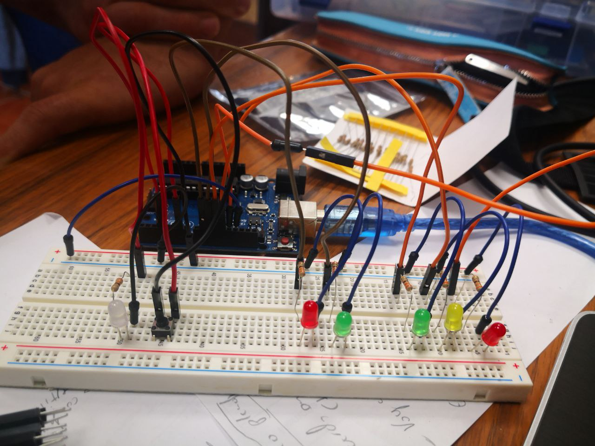
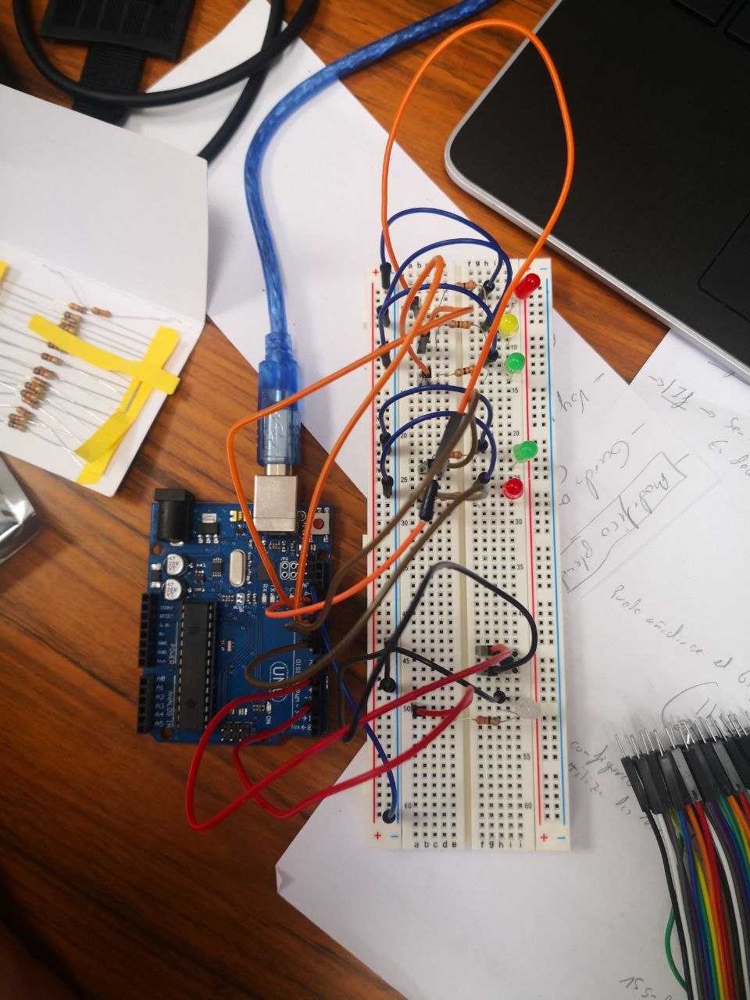

# Proyecto JC Semaforo

<cabeza><meta http-equiv="Content-Type" content="text / html; charset = utf-8"> <title> Lista de materiales de Fritzing </title>  <cuerpo>

# Lista de materiales: Sketch.fzz sin título

Sketch.fzz sin título

miércoles, 7 de octubre de 2020, 14:56:20

## Lista de ensamblado

<tabla>Etiqueta Tipo de pieza Propiedades Componente1 Arduino Uno (Rev3) Tipo Arduino UNO (Rev3) LED1 LED rojo (633 nm) paquete de 5 mm [THT]; pierna si; Color rojo (633 nm) LED2 LED amarillo (592 nm) paquete de 5 mm [THT]; pierna si; Color amarillo (592 nm) LED3 LED verde (555 nm) paquete de 5 mm [THT]; pierna si; Color verde (555 nm) LED4 LED verde (555 nm) paquete de 5 mm [THT]; pierna si; Color verde (555 nm) LED5 LED rojo (633 nm) paquete de 5 mm [THT]; pierna si; Color rojo (633 nm) LED6 LED blanco (6500K) paquete de 5 mm [THT]; pierna si; Color blanco (6500K) R2 Resistencia de 330Ω espacio entre pines 400 mil; tolerancia ± 5%; Resistencia 330Ω; paquete THT; bandas 4 R3 Resistencia de 330Ω espacio entre pines 400 mil; tolerancia ± 5%; Resistencia 330Ω; paquete THT; bandas 4 R4 Resistencia de 330Ω espacio entre pines 400 mil; tolerancia ± 5%; Resistencia 330Ω; paquete THT; bandas 4 R5 Resistencia de 330Ω espacio entre pines 400 mil; tolerancia ± 5%; Resistencia 330Ω; paquete THT; bandas 4 R6 Resistencia de 330Ω espacio entre pines 400 mil; tolerancia ± 5%; Resistencia 330Ω; paquete THT; bandas 4 R7 Resistencia de 330Ω espacio entre pines 400 mil; tolerancia ± 5%; Resistencia 330Ω; paquete THT; bandas 4 R8 Resistencia de 220Ω espacio entre pines 400 mil; tolerancia ± 5%; Resistencia 220Ω; paquete THT; bandas 4 S1 Botón pulsador paquete [THT]

## Lista de compras

<tabla>Importe Tipo de pieza Propiedades 1 Arduino Uno (Rev3) Tipo Arduino UNO (Rev3) 2 LED rojo (633 nm) paquete de 5 mm [THT]; pierna si; Color rojo (633 nm) 1 LED amarillo (592 nm) paquete de 5 mm [THT]; pierna si; Color amarillo (592 nm) 2 LED verde (555 nm) paquete de 5 mm [THT]; pierna si; Color verde (555 nm) 1 LED blanco (6500K) paquete de 5 mm [THT]; pierna si; Color blanco (6500K) 6 Resistencia de 330Ω espacio entre pines 400 mil; tolerancia ± 5%; Resistencia 330Ω; paquete THT; bandas 4 1 Resistencia de 220Ω espacio entre pines 400 mil; tolerancia ± 5%; Resistencia 220Ω; paquete THT; bandas 4 1 Botón pulsador paquete [THT]

Exportado con Fritzing 0.9.3- http://fritzing.org

</tabla></tabla></cuerpo></cabeza>